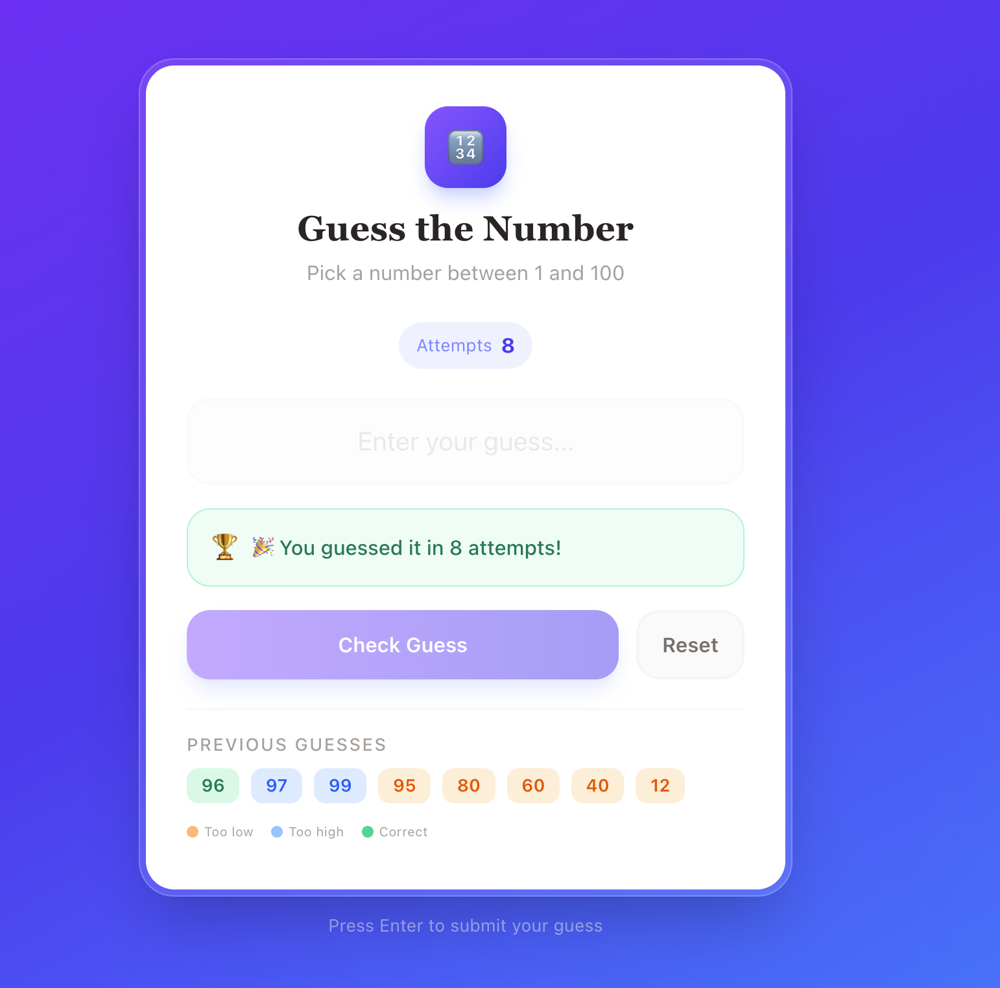

# 🎯 Guess the Number Game

A modern and interactive **Guess the Number Game** built with **React**, **TypeScript**, **Vite**, and **Tailwind CSS**.

The game generates a random number between **1 and 100**, and the player must guess the correct number. After each guess, the game provides instant feedback indicating whether the guess is too high or too low until the correct number is found.

---

## 🚀 Live Demo

> Add your deployed application link here.

Example:

```
https://guess-the-number-game-mjzktlmvo-shahbaz342s-9751s-projects.vercel.app/
```

---

## 📸 Screenshot



## ✨ Features

* 🎲 Random number generated between **1 and 100**
* 📈 Tracks the total number of attempts
* 💬 Instant feedback:

  * Too High
  * Too Low
  * Correct Guess
* ⌨️ Press **Enter** to submit a guess
* 🔄 Reset game functionality
* 📝 Guess history with color indicators
* ❌ Input validation for invalid numbers
* 📱 Fully responsive UI
* 🎨 Modern glassmorphism-inspired interface
* ⚡ Fast development with Vite

---

## 🛠️ Tech Stack

* React
* TypeScript
* Vite
* Tailwind CSS

---

## 📂 Project Structure

```
src/
│── components/
│── App.tsx
│── main.tsx
│── index.css
│── assets/
```

---

## 📦 Installation

Clone the repository

```bash
git clone https://github.com/your-username/guess-the-number-game.git
```

Navigate to the project

```bash
cd guess-the-number-game
```

Install dependencies

```bash
npm install
```

Start the development server

```bash
npm run dev
```

---

## 📜 Available Scripts

Start development server

```bash
npm run dev
```

Build for production

```bash
npm run build
```

Preview production build

```bash
npm run preview
```

Run linting

```bash
npm run lint
```

---

## 🎮 How to Play

1. Enter a number between **1 and 100**.
2. Click **Check Guess** or press **Enter**.
3. The game will tell you if your guess is:

   * 📉 Too Low
   * 📈 Too High
4. Continue guessing until you find the correct number.
5. Your attempt count and previous guesses are displayed throughout the game.
6. Click **Reset** to start a new game.

---

## 💡 Future Improvements

* Difficulty levels (Easy, Medium, Hard)
* Timer mode
* Maximum attempts challenge
* Scoreboard
* Sound effects
* Dark/Light mode
* Local storage for high scores
* Multiplayer mode

---

## 📚 What I Learned

While building this project, I practiced:

* React Hooks (`useState`)
* Event handling
* Controlled components
* Conditional rendering
* TypeScript in React
* Tailwind CSS styling
* State management
* Input validation
* Responsive UI design

---

## 🤝 Contributing

Contributions are welcome.

1. Fork the repository.
2. Create a feature branch.
3. Commit your changes.
4. Push the branch.
5. Open a Pull Request.

---

## 📄 License

This project is licensed under the MIT License.

---

## 👨‍💻 Author

**Your Name**

GitHub: https://github.com/shahbaz342k

LinkedIn: https://www.linkedin.com/in/mohd-shahbaz-5796b6127/
